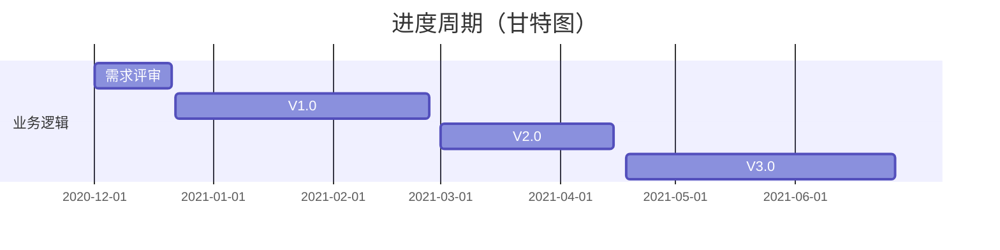
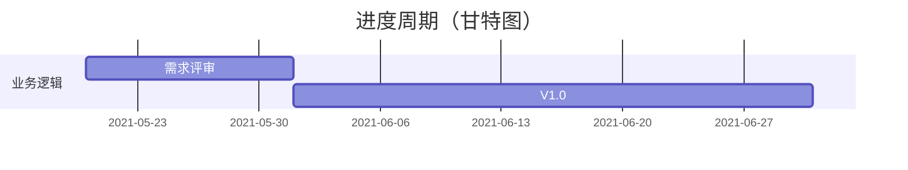
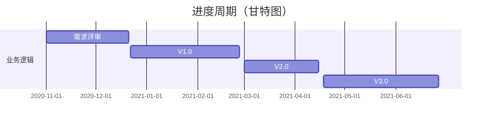
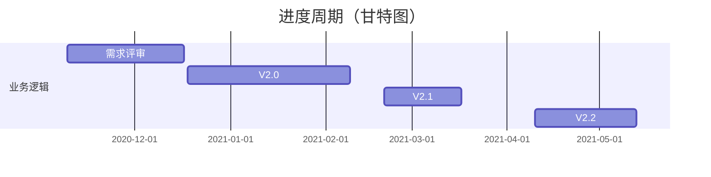

# 壹。 自我介绍

## 个人信息
- 头像：
- 
- 姓名：李淳淳
- 求职意向：**前端开发**想转**全栈开发**（对大数据、人工智能感兴趣）
- 联系方式：15610045821
- 电子邮箱：961150665@qq.com
- 个人博客：[淳淳同学的个人博客](https://leedebug.github.io/)

## 技能掌握
- 熟练运用：vue2.x、vue3.x、Element Plus、Vuex、Vue-Router、...
- 灵活使用：Webpack、qiankun、TypeScript、Vite、Bus、微信小程序...
- 额外了解：Electron、Django + Restful Api、Taro、Uni-App、...

## 教育经历
- 专业硕士研究生(非全日制)，青岛大学(2018.9-2021.7)，计算机技术;
- 本科，青岛理工大学(2014.9-2018.7)，网络工程;

## 个人评价
- 坚持`6`年相声演出;坚持`3`年每天写日记;
- 喜欢研究阅读源码;喜欢对新技术落地实施;
- 细节把握成败;勇于犯错且敢于承担责任;
- 性格外向开朗;善于团队合作;


# 贰。 项目详细介绍

## V7联络云 - 访客端（PC + H5）

从2020-12-01至今历时7个月，已迭代至V3.4.2版本。



### 介绍

打造一款`更轻便的消息渲染器`，让客户仅需要添加一段`script代码`即可为自己的网站提供`智能在线客服的能力`（手机官网、app、小程序等跳转H5链接即可）。

```js
// 技术栈（无任何UI框架）
"axios": "0.21.0",
"qiniu-js": "3.1.2",
"socket.io-client": "2.3.0",
"v3-carousel": "1.1.1", // 自己封装并发布npm的开源轮播组件
"vue": "3.0.4",
"vue-i18n": "9.0.0-beta.15",
"vuex": "4.0.0-rc.2",
"xss": "1.0.8",
"crypto-js": "4.0.0",
"stylus": "0.54.7",
"typescript": "4.1.3",
"vite": "2.3.4",
```

### 功能

- `自动邀请框`：首次自动弹出、关闭后n秒重新弹出、配置可弹出时机、快捷咨询发起会话、自定义样式、缩小后未读消息提示等
- `机器人流程`：联想输入、快捷回复按钮、有无帮助、关键词及按钮转人工等
- `人工咨询流程`：文本消息、富文本消息、emoji表情、文件图片视频、满意度评价（主动、被动、结束会话）、粘贴图片即发送、发送loading与失败重发、已读未读、发送消息节流、会话转接等
- `留言流程`：表单留言、文本消息留言等
- 自定义主题色、自定义弹窗及咨询按钮位置、会话流程日志打印等
- 多处轮播广告栏、首次广告语推送、自定义图片视频、iframe嵌入等
- 刷新页面记忆流程节点、socket心跳检测及意外断开重连、消息时序问题、多端登录互踢等

### 亮点

- 多入口打包，同时兼容`PC`和`H5`的方式打开
- 更完善的流程与状态管理，可拖拽的配置方式，客户可自由搭配
- 智能引导菜单、机器人、人工、留言、广告推送等多种留资方式
- 多种自定义样式模板：`pc`模板、`h5`模板、广告模板、小程序模板
- 配置信息、聊天内容、`socket`推送等敏感信息用`crypto-js`加密

### 难点

- 首次从〇开始初始化 `vue3` + `ts` 项目
- 项目多入口打包方式的构思与实现
- `socket` 的事件推送与处理维护机制
- `emoji` 表情采用雪碧图（精灵图）的形式展示
- 消息列表渲染、消息类型区分、列表滚动机制
- 移动端兼容问题（键盘遮挡、hover样式不消失等）
- 客户页与`iframe`内部通过`postMessage`事件通信
- 前端用`sendStatus`字段维护消息的状态
- 使用`xss`的`FilterXSS`方法进行消息过滤
- 把富文本消息要绑定的函数挂载到`window`上即可调用
- IOS上点击输入框会被弹起的键盘遮挡住
- IOS上不支持直接使用`transparent`透明属性
- Android微信浏览器，点击`type=file`的`input`框选取文件会报错
- 手机端上元素点击后`:hover`样式不会自动消失
- 图片加载小图、预加载骨架

---

## V7联络云 - 访客端（微信小程序插件）



### 介绍

将访客端以插件的形式移至微信小程序内，宿主（即插件调用者）仅需使用插件版本号与插件开发者的AppId即可实现智能客服能力。

```js
// 技术栈：
"@vant/weapp": "1.0.0",
"crypto-js": "4.0.0",
"miniprogram-api-promise": "1.0.4",
"miniprogram-computed": "4.0.4",
"mobx-miniprogram": "4.13.2",
"mobx-miniprogram-bindings": "1.2.1",
"mp-html": "2.1.3",
"weapp.socket.io": "2.1.0"
```

### 功能

- 大部分功能同h5访客端
- 座席端的样式配置、基座小程序的功能配置
- Emm...

### 亮点

- Emm...

### 难点

- uni-app ==> mp-vue ==> wepy ==> taro/cli ==> 原生 + npm
- 宿主与插件的事件交互机制问题（宿主直接调用插件函数，传参数或回调函数）
- 更新mobx中的引用类型数据后，无法触发视图更新（list=list，obj=Object.assign(obj, obj1)）
- 在js文件中的非Component模块中以及mobx中，无法获取dom节点（使用scroll-view的scroll-top属性代替手动滚动行为，定义一个超大数值COUNT++）
- 不能出现文件循环引用的问题（缺点即：无法将mobx模块化）
- socket没有自带的心跳检测（需要配合计时器手动监听）
- 没有style标签的概念，无法创建全局样式（只能通过mobx进行数据绑定）
- 微信开发者工具的BUG：wxml没有a标签、wxss不能穿透、在插件内调用宿主的路由跳转api报错、text标签内不能换行、插件内不能使用webview_App({})_getApp()方法

---

## V7联络云



### 介绍

采用蚂蚁金融科技提供的 `qiankun` 微前端框架，将我司现有的 `零代码平台` 产品 [Mopower](https://power.7moor.com/home/workbench) 嵌入到新开发的 `V7联络云` 中，实现客户与工单模块的表单配置、用户角色的权限配置、以及客户的关联与应用等功能。

### 功能

- 通话模块和在线客服模块，以及相对应的数据报表中心
- 客户模块和工单模块，以及相对应的表单配置模块
- 消息中心模块，全局的接入、转接、下载、导入导出的提示
- 知识库模块，为在线客服提供更多智能话术模板
- OEM自定义域名配置及相关私密信息脱敏

### 亮点

- qiankun框架的应用解决了iframe的跳转与数据交互的痛点
- 使用`qiankun`微前端框架嵌入其他子应用，并将自身作为子应用嵌入其他基座
- 封装vue-router，根据接口数据动态生成路由，且可使用多个字段进行权限控制

### 难点

- 基座与子应用之间的样式污染问题，特别是子应用插入到基座Body中的Dom元素（采用BEM命名规范的思想与postcss命名空间插件共同解决）。在不开沙箱的情况下使用`postcss`的插件解决`css`样式污染和`iconfont`冲突问题
- 使用 bus + keep-alive + vue生命周期 封装qiankun的子应用组件

---

## 七陌官网重构



### 介绍

由于容联集团于 2021年02月09日 赴美上市，所以对容联七陌的 [PC端官网](https://www.7moor.com/) 和 [移动端官网](https://m.7moor.com/) 进行代码重构及新页面的改版。

### 功能

- 使用 vue-router 进行路由改版
- 引入 gio 埋点

### 亮点

- 使用 [PrerenderSPAPlugin](https://github.com/chrisvfritz/prerender-spa-plugin) 对单页面官网应用进行预渲染

### 难点

- @import引入的css不走px3rem-loaders，改为src的引入形式
```
- <style scoped>
-   @import './indexStyle.css';
+ <style scoped src="../../assets/css/indexStyle.css">
  </style>
```


# 叁。 模拟问答

### 负责过什么项目，以及在每个项目中的职责？
答：
- 七陌专注于做企业通信领域的SAAS云服务提供商，是一家提供智能客服解决方案的。
- 虽然我入职仅一年，但已经独立完整的负责过两个项目：
  - 一个是智能客服的访客端，分别打包成js接入和h5链接的形式；
  - 另一个项目也是访客端，是把现有的访客端开发成原生小程序插件的形式（也就是SDK的形式）；
- 还有客服座席端的客户、工单等模块，采用qiankun微前端框架嵌入了子项目的重要模块；
- 还有pc端和wap端七陌官网的重构；

### 遇到过什么困难的问题，以及解决方案？
答：
- webpack多入口打包
- 访客端ui高度自定义化
- qiankun样式污染问题
- 消息列表渲染，滚动时机
- 利用雪碧图做emoji表情墙
- 小程序宿主与插件的事件交互
- vue3 + ts 学习成本

### 平时如何学习？如何做到 WLB ？
答：
- 白天认真工作，工作才是第一生产力
- 晚上总结输出，只有多产出才能记住
- 平时多交流沟通，每个月会做1-2次技术分享
- 定时更新博客，记录学到的内容并学会总结分享


# 肆。 备注

写点儿啥呢。。。

